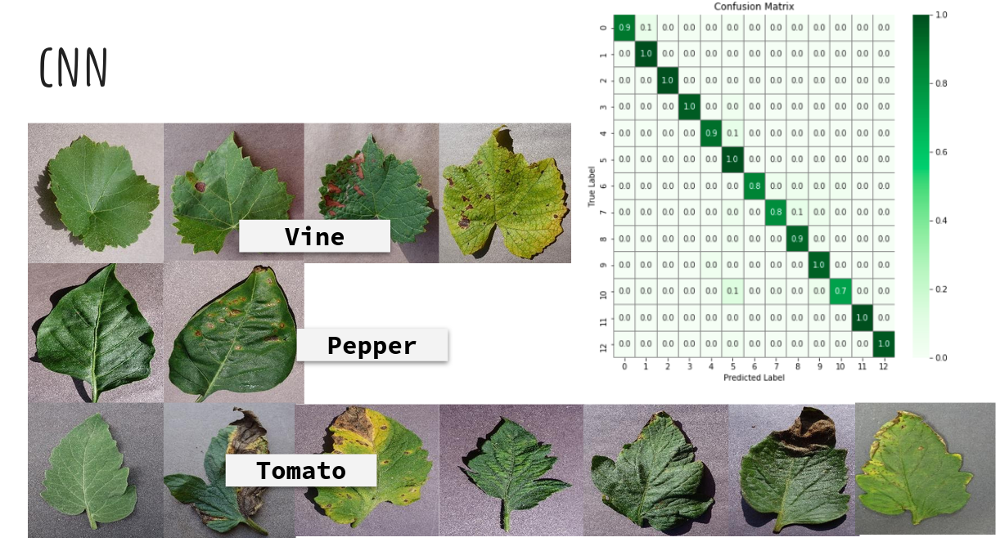
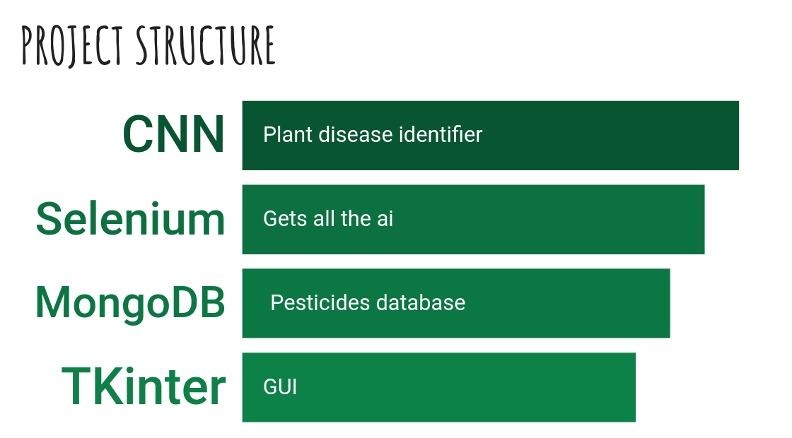

# Plant diseases identifier

Welcome to my final project for the data analytics bootcamp!  

This app recognise the following diseases using a picture of a leaf:  
- Grape: black rot, black measles (scab) and leaf blight (leaf spot).  
- Pepper bell: bacterial spot.  
- Tomato: bacterial spot, early blight (Alternaria), late blight (Phytopthora), leaf spot (Septoria) and mosaic virus.  

Also it shows you the available pesticides in Spain the fight the specified disease.  

<!--  -->

## How to use this app

1- Insert the leaf picture in the app.
2- Specify the crop and the disease to get the available Ai's in Spain.  
3- Select the Ai and get the available pesticides.  

## Used technologies in this project

I used keras in Google Colaboratory for the CNN training used for the diseases recognition system. For the web scraping tasks I used Selenium with Opera web browser, the pesticides database I built it with MongoDB Atlas (Cloud) and the gui was designed using Tkinter+pygubu.

<!--  -->

## Files included

- `CNN.py` -> CNN training + training plots display and confusion matrix.  
- `main.py` -> predictions function using the trained model.  
- `requeriments.txt` -> md file containing all the modules used in this app.
- `colab` -> CNN training + confusion matrix creation.  
- `src` -> auxiliary py's containing the functions used in the app and in the CNN train.

## Contact info

If you have any doubt please don't heisitate to contact me:

- email : jgph91@gmail.com
- linkedin:  <a href="https://www.linkedin.com/in/javier-gomez-del-pulgar/?locale=en_US">Javier Gómez del Pulgar</a>